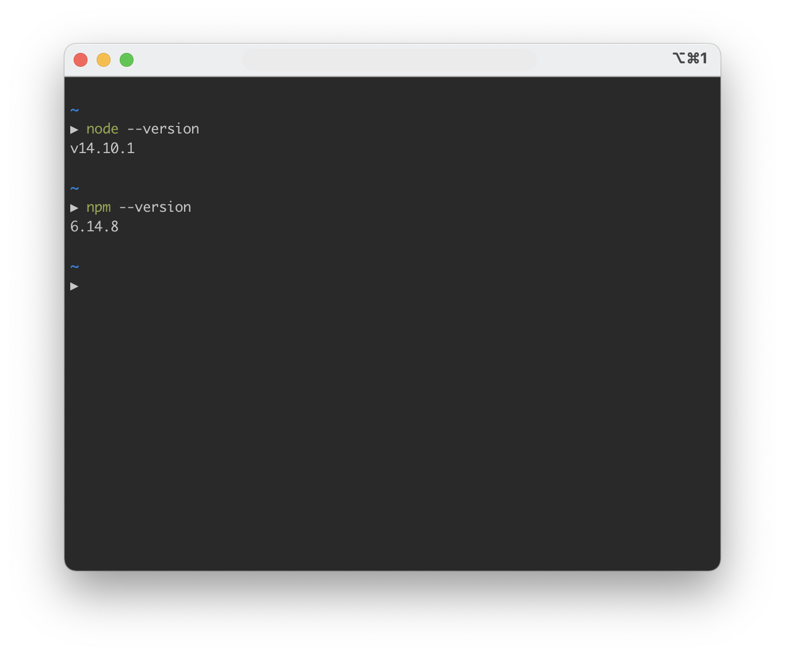
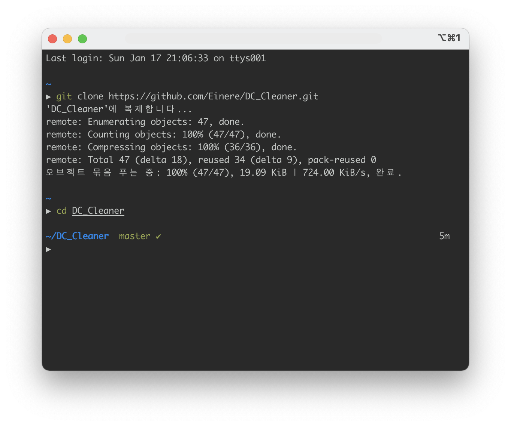
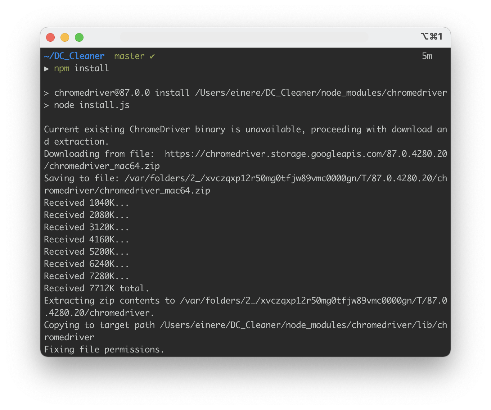
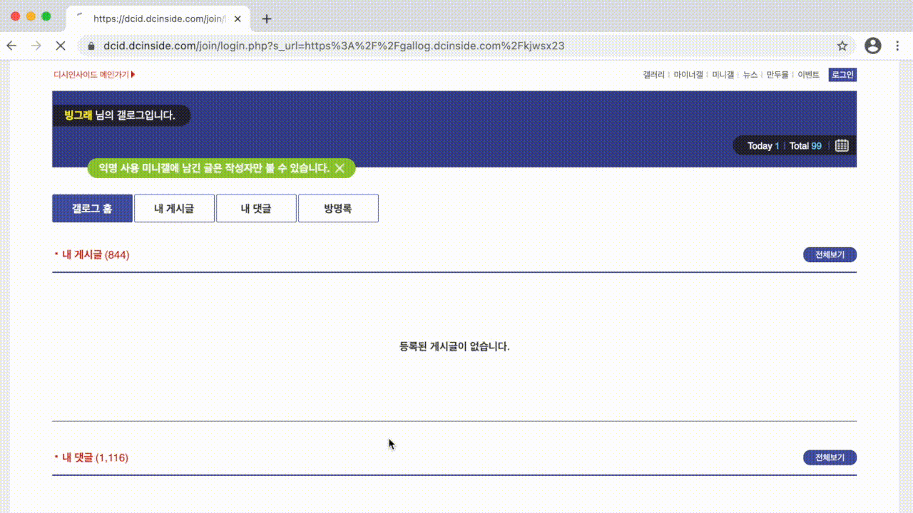

# DC Cleaner

light DC Cleaner using Node.js.  
Node.js 기반 초경량 DC 클리너입니다.  
최대한 비개발자도 따라할 수 있게 작성했습니다만, 실제로 그럴지는 잘 모르겠네요.    

# Requirement

> 💡  
> 모든 명령어의 **$** 기호는 터미널 입력이라는 의미이므로, 따라 치실때는 $ 기호를 빼시면 됩니다.

## Git

[Git Download](https://git-scm.com/downloads)

위 링크에서 운영체제에 맞는 Git을 설치하시면 됩니다.

## Node.js & NPM

[Node.js Download](https://nodejs.org/ko/download/)

install Node.js and npm appropriately with your OS.  
운영체제 맞게 Node.js 및 npm을 설치합니다. (Node.js 설치 시, npm은 자동으로 같이 설치됩니다.)  

> 🚨  
> node.js를 다운로드 후, 실행하지 않으셔도 됩니다. 
> 이후 모든 명령어는 node 창이 아닌, 터미널 창에서 실행하시기 바랍니다.  
> Windows 운영체제라면, [Windows Terminal](https://docs.microsoft.com/ko-kr/windows/terminal/get-started) 을 참고해서 **터미널** 실행해주시기 바랍니다.

다음 명령어를 실행하여 버전이 제대로 출력되는지 확인하는 것으로, Node.js 및 npm의 설치가 되었는지 확인할 수 있습니다.

```bash
$ node --version
```

```bash
$ npm --version
```



# Install

### Clone project  

clone the project.  
프로젝트를 클론합니다.  

```bash
$ git clone https://github.com/Einere/DC_Cleaner.git
```

그리고 해당 폴더로 이동합니다.
```bash
$ cd DC_cleaner
```



### Install package

install dependency pakages.  
의존성 패키지를 설치합니다.  

```bash
$ npm install
```



### Make configuration

make `config.js`, fill content like below in current directory.  
`config.js` 파일을 현재 폴더 내에 생성한 다음, 밑의 내용을 복사해서 붙여넣고 저장합니다.

```javascript
const config = {
  id: 'your_id',
  pw: 'your_password',
  interval: 500,
  category: 'posting',
};

module.exports = config;
```

> 💡  
> 해당 파일을 만들어야 하는 폴더는 터미널에 나와 있는 경로를 참고해주세요.
> Window OS 기준으로, C:\Users\사용자 이름\DC_cleaner 일 확률이 높습니다.

see `config` object specification.  
`config` 객체의 필드 및 값은 다음 표를 참고해주세요.

| filed    	| value type 	| require 	| description            	|
|----------	|------------	|---------	|------------------------	|
| id       	| string     	| yes     	| your DC id             	|
| pw       	| string     	| yes     	| your DC password       	|
| interval 	| number     	| no      	| delete interval        	|
| category 	| string     	| no      	| "posting" or "comment" 	|


# Run

```bash
$ npm run start
```



# Error handling

### DC prevent deleting by capcha

만약 로봇이 아닌가요? 때문에 삭제가 안된다면, 크롬 창을 끄고 10분 정도 뒤에 다시 실행헤주세요.

### Chrome driver version error

`./package.json`

```json

{
  "dependencies": {
    "chromedriver": "^87.0.0"
  }
}
```

update `chromedriver` version value that using chrome's version.  
현재 사용중인 크롬 버전과 동일하게 수정해주세요.

# TMI

설치 및 실행에 어려움을 겪으시는 분들이 많아서 실행가능한 파일로 만들어보려고 했으나, 빈번히 실패해서 일단은 보류중입니다.. 😞  
다소 번거로우시더라도, 위 절차에 따라주시길 바라며, 귀찮으시다면 다른 클리너를 찾으시는게 더 좋을 수도 있습니다. 😅  
